# 🏗️ BlueFalconInk LLC — videogamedev Architecture

> **Created with [Architect AI Pro](https://architect-ai-pro-mobile-edition-484078543321.us-west1.run.app/)** — the flagship architecture tool by **BlueFalconInk LLC**
> Auto-generated on 2026-02-20 15:13 UTC | [GitHub Action source](https://github.com/koreric75/ArchitectAIPro_GHActions)

## Architecture Diagram

```mermaid
%% Generated by Architect AI Pro | BlueFalconInk LLC
%% https://architect-ai-pro-mobile-edition-484078543321.us-west1.run.app/
%% Remediated by Architect AI Pro Foreman
graph TD
    subgraph "BlueFalconInk LLC — videogamedev Architecture"
        User[End User]

        subgraph "Security"
            CloudArmor[Cloud Armor]
            CloudCDN[Cloud CDN]
            style Security fill:#1E40AF,color:#BFDBFE
        end

        subgraph "Frontend"
            Browser[Web Browser]
            HTMLCanvas[HTML5 Canvas]
            VirtualJoystick[Virtual Joystick UI]
            ActionButton[Action Buttons UI]
            MusicUploader[Music Uploader UI]
            style Frontend fill:#1E3A5F,color:#BFDBFE
        end

        subgraph "Application"
            GameEngine[TypeScript Game Engine]
            MainScene[Main Game Scene]
            ECS[Entity-Component-System]
            PhysicsSystem[Physics System]
            RenderSystem[Render System]
            InputSystem[Input System]
            AudioSystem[Audio System]
            AssetLoader[Asset Loader]
            SpriteSpawner[Sprite Spawner]
            style Application fill:#1E3A5F,color:#BFDBFE
        end

        subgraph "Data"
            CloudStorage[Cloud Storage · Game Assets]
            BrowserStorage[Browser Local Storage]
            style Data fill:#0F172A,color:#BFDBFE
        end

        User -->|Accesses via HTTPS| CloudArmor
        CloudArmor -->|Filters Traffic| CloudCDN
        CloudCDN -->|Serves Static Files HTML, JS, CSS| Browser
        CloudStorage -->|Origin for Assets| CloudCDN

        Browser -->|Renders Game| HTMLCanvas
        Browser -->|User Input| VirtualJoystick
        Browser -->|User Input| ActionButton
        Browser -->|User Uploads Music File| MusicUploader
        MusicUploader -->|Provides Audio Data| AudioSystem
        HTMLCanvas -->|Game Loop| GameEngine
        GameEngine -->|Manages Game State| MainScene
        MainScene -->|Interacts with| ECS
        ECS -->|Updates Entities| PhysicsSystem
        ECS -->|Draws Entities| RenderSystem
        GameEngine -->|Processes Events| InputSystem
        InputSystem -->|Controls Entities| ECS
        GameEngine -->|Manages Sound| AudioSystem
        GameEngine -->|Loads Resources| AssetLoader
        AssetLoader -->|Retrieves| CloudStorage
        GameEngine -->|Spawns Objects| SpriteSpawner
        SpriteSpawner -->|Creates Entities| ECS
        AudioSystem -->|Plays/Degrades Sound| CloudStorage
        ECS -->|Persists Game Data| BrowserStorage
        BrowserStorage -->|Loads/Saves Game Data| ECS

        FOOTER[🏗️ Created with Architect AI Pro · BlueFalconInk LLC]
        style FOOTER fill:#1E40AF,color:#BFDBFE,stroke:#3B82F6
    end
```

📄 View Mermaid Source Code

---

## 📋 BlueFalconInk LLC Building Code Compliance

| Standard | Requirement | Status |
|----------|-------------|--------|
| Cloud Provider | GCP | ✅ Enforced |
| IaC | Terraform | ✅ Enforced |
| Orchestration | Cloud Run | ✅ Enforced |
| API Standard | REST/GraphQL | ✅ Enforced |
| Security Boundary | Required | ✅ Enforced |
| Cloud Armor / LB for Public | Required | ✅ Enforced |
| Brand Identity | BlueFalconInk LLC | ✅ Enforced |

---

## 🏢 About

This architecture diagram was generated by **[Architect AI Pro](https://architect-ai-pro-mobile-edition-484078543321.us-west1.run.app/)**, the flagship
architecture tool built by **BlueFalconInk LLC**. Architect AI Pro analyzes your source code and
produces compliant, production-ready architecture diagrams using Google Gemini AI.

📎 **Live App:** [https://architect-ai-pro-mobile-edition-484078543321.us-west1.run.app/](https://architect-ai-pro-mobile-edition-484078543321.us-west1.run.app/)
📎 **GitHub Actions:** [https://github.com/koreric75/ArchitectAIPro_GHActions](https://github.com/koreric75/ArchitectAIPro_GHActions)

---

*© BlueFalconInk LLC. All rights reserved. Automated Governance. Living Blueprints. Ruthless Consistency.*
